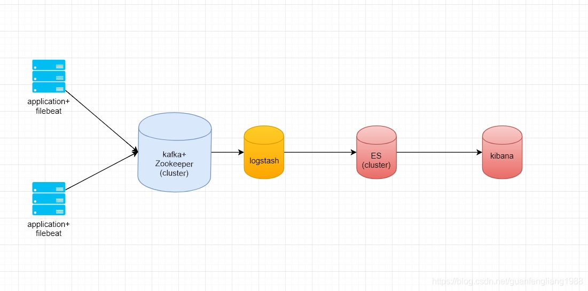
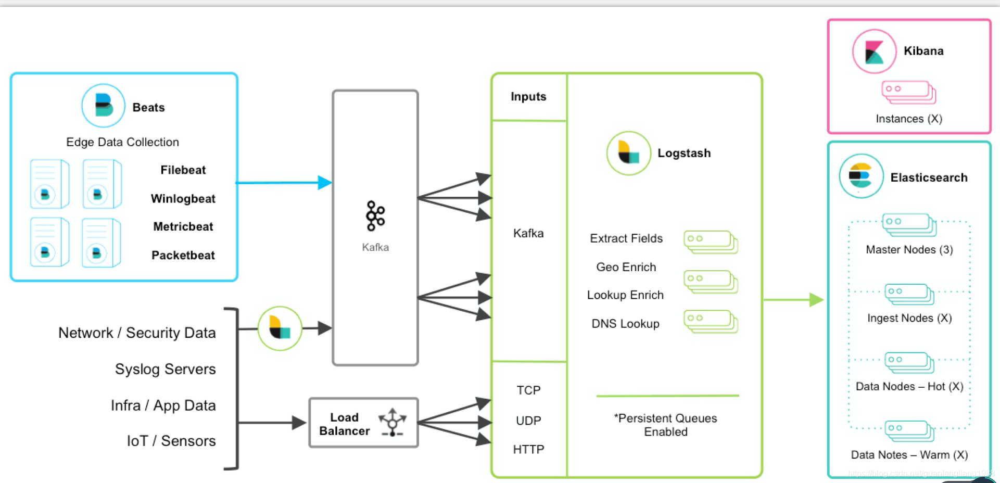

###### datetime:2020/11/24 11:15
###### author:nzb

## 目录树
```text
docker-elk-filebeat
    ├── compose                       
    │    ├─ filebeat                  
    │    ├─ logstash                  
    │    ├─ elasticsearch             
    │    ├─ kibana                    
    │    ├─ nginx                      
    │    └─ django_demo                
    ├── imgs                                     
    ├── .gitignore
    ├── .env                          
    ├── docker-compose.yml                  
    └── README.md                
```

> 配置镜像源， docker-compose 的时候会经常超时，重新运行命令即可，不会影响前面已经拉取构建的镜像

- 配置文件
    - filebeat：[filebeat.yml](./compose/filebeat/config/filebeat.yml) 输出配置
    - logstash：[logstash.conf](./compose/logstash/pipeline/logstash.conf) 输入配置     
    - elasticsearch 账号密码：
        - [logstash.conf](./compose/logstash/pipeline/logstash.conf)    
        - [kibana.yml](./compose/kibana/config/kibana.yml)

- django 项目启动及数据库迁移命令
    docker exec -it container_name /bin/bash -c "start.sh"

- 安装成功检查
    - elasticsearch 安装成功检查：浏览器中访问端口 9200
    - kibana 安装成功检查：浏览器中访问端口 5601，账号密码[在这](./compose/kibana/config/kibana.yml)

- [Kafka](https://github.com/wurstmeister/kafka-docker.git)
    - [安装说明及使用](https://www.cnblogs.com/qa-freeroad/p/13780405.html)
        - 配置 `docker-compose.yml` 中的 `KAFKA_ADVERTISED_HOST_NAME`
    - 命令
        - 启动： `docker-compose up`（查看输出，没错误时 加参数 -d 后台运行）
        - kafka 扩容：`docker-compose scale kafka=2`
        - Kafka Shell
            - 进入 shell： `start-kafka-shell.sh <DOCKER_HOST_IP> <ZK_HOST:ZK_PORT>`
            - 创建 topic：`kafka-topics.sh --create --topic test_topic --partitions 8 --zookeeper $ZK --replication-factor 2` 创建一个分区数为8，副本数为2的topic
            - 查看所有已创建的 topic： `kafka-topics.sh --list --zookeeper $ZK` 
            - 查看指定的 topic：`kafka-topics.sh --describe --topic test_topic --zookeeper $ZK`
            - 删除某个 topic：`kafka-topics.sh --delete --zookeeper $ZK --topic test_topic`
            - 开启生产者：``kafka-console-consumer.sh --topic test_topic --broker-list `broker-list.sh` ``    
            - 开启消费者：`kafka-console-consumer.sh --topic=test_topic --bootstrap-server=<DOCKER_HOST_IP:KAFKA_PORT>` 
    
    - kafka 外网内网配置：Kafka 无法外网访问问题解决方法
        
        编辑 server.properties
        
        - 外网配置
            ```
                #listeners=PLAINTEXT://:9092
                advertised.listeners=PLAINTEXT://x.x.x.x:9092
                zookeeper.connect=localhost:2181
            ```

        - 内网配置
            ```
                #listeners=PLAINTEXT://:9092
                listeners=PLAINTEXT://x.x.x.x:9092
                zookeeper.connect=localhost:2181
            ```
            
    - tips
        - ~~kafka 等端口映射失败，请先删除已创建的容器，在运行 docker-compose up -d~~
        - 消费报错时可以尝试删除容器重新启动
        - 不建议端口绑定，绑定了不能扩容 kafka 实例

- 架构图
    
    - 简易版
    
    - 标准版
    